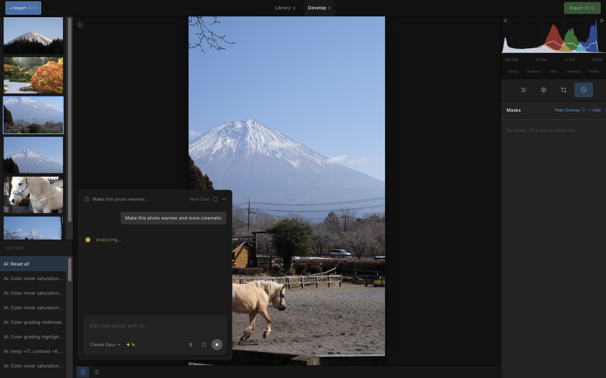

# Zenliro


[English](./README.md) | [Tiếng Việt](./README.vi.md) | [日本語](./README.ja.md) | [中文](./README.zh.md) | [Русский](./README.ru.md)

> **Enhance, not alter.** Lightroom Classic에서 영감을 받은, AI Agent 기반의 사진 현상 앱.

Zenliro는 무드, 톤, 그리고 진정성을 중시하는 사진가를 위한 데스크톱 사진 처리 및 컬러 그레이딩 도구입니다. 파괴적 편집기가 아닙니다 — 객체 제거도, 인페인팅도 없습니다. 오직 빛, 색, 그리고 감성만.

---

## 데모

- 메인 작업 공간: 
- 비교 모드: 
- 다중 Agent 사진 편집: 
- AI 일괄 편집: 

---

## 웹사이트

[zenliro](https://zenliro.vercel.app/)

---

## 기능

- **사진 처리** — Raw, JPG, PNG, WebP, BMP, GIF 및 TIFF 포맷 임포트. EXIF 메타데이터와 전체 히스토그램을 한눈에 확인.
- **Develop 모듈** — Lightroom Classic과 동등한 패널 구성: Basic, Tone Curve, HSL, Color Grading, Detail 등.
- **키보드 단축키** — 효율적인 워크플로를 위해 설계된 직관적인 단축키.
- **사진 라이브러리** — 드래그 앤 드롭을 지원하는 폴더 기반의 직관적인 사진 관리.
- **AI Agent** — Agent가 사진을 분석하고 조정을 계획하며 실시간으로 편집합니다. 마치 사진가가 컨트롤을 조작하듯 작업하는 모습을 지켜볼 수 있습니다. 참조 이미지의 스타일을 복사하거나 자율적으로 최상의 결과를 만들어낼 수 있습니다.
- **AI 일괄 편집** — 여러 사진을 AI Agent에 맡겨 처리합니다. Agent가 자동으로 편집하고 완료되면 알려줍니다.
- **비파괴 편집** — 완전한 undo/redo 히스토리. 원본 파일은 절대 건드리지 않습니다.
- **스타일 프리셋** — 다양한 무드와 장르를 위한 40+ 큐레이션 룩.
- **WebGL 렌더링** — GPU 상에서 완전히 실시간 컬러 처리를 수행하는 자체 제작 셰이더.

---

## 기술 스택

```
Electron
├── React + Vite + TypeScript      → UI (Feature-Sliced Design 아키텍처)
├── Shadcn/ui + Tailwind CSS       → 컴포넌트 시스템
├── WebGL (커스텀 셰이더)           → 실시간 GPU 컬러 처리
├── Zustand                        → 상태 관리
└── MCP 서버                       → 지능형 사진 편집을 위한 AI agent
```

---

## 시작하기

```bash
pnpm install
pnpm dev
```

### 빌드

현재 macOS만 지원

```bash
pnpm dist:mac    # macOS DMG (arm64)
```

### GitHub Releases에서 설치 (.dmg)

#### 1단계: [Releases](https://github.com/LeHoangTuanbk/zenliro/releases) 페이지에서 `.dmg`를 다운로드하고 평소처럼 설치합니다.

#### 2단계: 코드 서명 및 공증이 없는 오픈소스 앱이기 때문에, 첫 실행 시 macOS가 차단할 수 있습니다:


해결하려면 터미널을 열고 다음을 실행하세요:

```bash
xattr -cr /Applications/Zenliro.app
```

#### 3단계: Zenliro를 다시 실행합니다.

### AI 사진 편집

AI 사진 편집 기능을 사용하려면, Claude Code 또는 Codex CLI, 혹은 둘 다 다운로드하여 설치해야 합니다:

- **Claude Code**: https://code.claude.com/docs/en/overview
- **Codex CLI**: https://developers.openai.com/codex/cli

---

## TODO

- [ ] 버그 수정
- [x] 더 나은 사진 관리 기능 및 더 편리한 단축키 추가
- [ ] 이미지 처리 성능 최적화
- [ ] Agent 사진 편집 개선
- [ ] 멀티 해상도 파이프라인 지원
- [x] RAW 사진 포맷 지원

---

## 기여 방법

1. 하고 싶은 작업에 대해 논의할 이슈를 엽니다.
2. 접근 방식과 구현 전략이 합의되면 저장소를 포크합니다.
3. 변경사항과 함께 PR을 제출합니다.
4. 필요한 경우 문서를 업데이트하고 테스트 케이스를 추가합니다.

---

## 영감을 받은 프로젝트

- [Lightroom Classic](https://www.adobe.com/products/photoshop-lightroom-classic.html)
- [RapidRAW](https://github.com/CyberTimon/RapidRAW)
- [Pencil](https://www.pencil.com)

---

## 라이선스

[AGPL-3.0](./LICENSE) 라이선스를 따릅니다.

Zenliro의 수정된 버전을 배포하거나 배치할 경우 — 호스팅 서비스 형태를 포함하여 — 동일한 라이선스로 소스 코드를 공개하고 원본 프로젝트를 표기해야 합니다.
