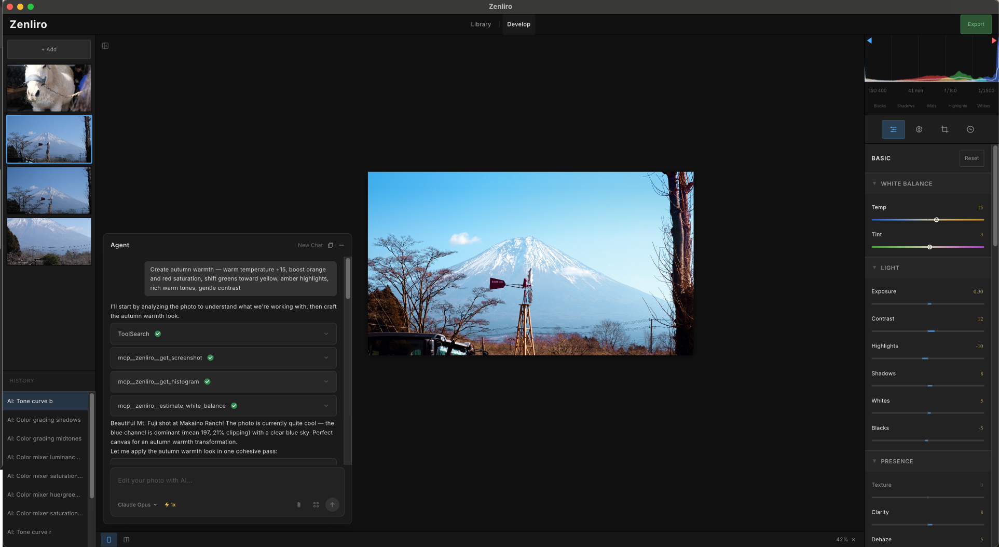
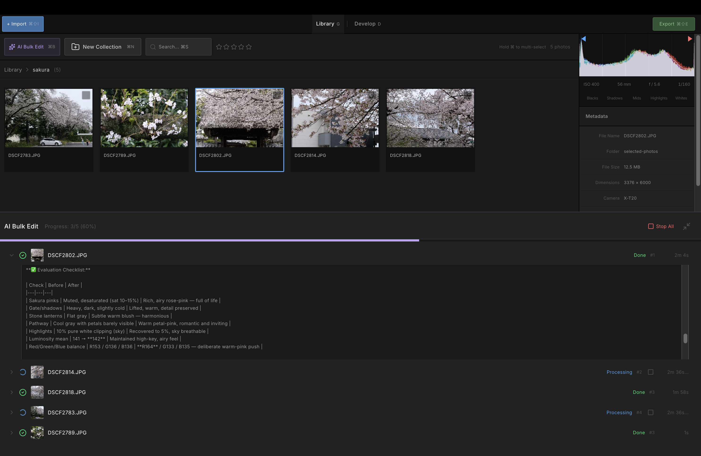
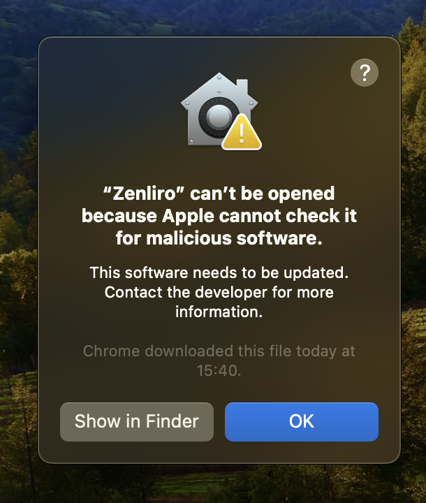

# Zenliro


> **Enhance, not alter.** A Lightroom Classic-inspired photo development app powered by AI Agent.

Zenliro is a desktop photo processing and color grading tool built for photographers who care about mood, tone, and authenticity. Not a destructive editor — no object removal, no inpainting. Just light, color, and feel.

---

## Demo

- Main workspace: 
- Compare mode: 
- AI bulk Edit 

---

## Website

[zenliro](https://zenliro.vercel.app/)

---

## Features

- **Photo Processing** — Import Raw, JPG, PNG, WebP, BMP, GIF and TIFF photo format. View EXIF metadata and overall histogram at a glance.
- **Develop Module** — Full panel parity with Lightroom Classic: Basic, Tone Curve, HSL, Color Grading, Detail, and more.
- **Keyboard shortcuts** - Intuitive keyboard shortcuts designed for efficient workflow.
- **Photo Library** - Manage photos intuitively as folders with drag-and-drop support.
- **AI Agent** — Agent analyzes your photo, plans adjustments, and edits in real-time. Watch it work like a photographer at the controls. Can copy the style of a reference image or craft the best possible output autonomously.
- **Bulk Edit with AI** - Assign a batch of photos to the AI Agent for processing. The Agent will automatically edit them and notify you when it's done.
- **Non-destructive** — Full undo/redo history. Original file is never touched.
- **Style Presets** — 20+ curated looks for different moods and genres.
- **WebGL Rendering** — Custom-written shaders for real-time color processing entirely on the GPU.

---

## Tech Stack

```
Electron
├── React + Vite + TypeScript      → UI (Feature-Sliced Design architecture)
├── Shadcn/ui + Tailwind CSS       → Component system
├── WebGL (custom shaders)         → Real-time GPU color processing
├── Zustand                        → State management
└── MCP server                     → AI agent for intelligent photo editing
```

---

## Getting Started

```bash
pnpm install
pnpm dev
```

### Build

Only support Macos right now

```bash
pnpm dist:mac    # macOS DMG (arm64)
```

### Installing from GitHub Releases (.dmg)

#### Step 1: Download the `.dmg` from the [Releases](https://github.com/LeHoangTuanbk/zenliro/releases) page and install as usual.

#### Step 2: Since this is an open-source app without code signing and notarization, macOS may block it on first launch:



To fix this, open Terminal and run:

```bash
xattr -cr /Applications/Zenliro.app
```

#### Step 3: Launch Zenliro again.

### AI Photo Editing

To use the AI photo editing feature, you need to download and install Claude Code or Codex CLI or both:

- **Claude Code**: https://code.claude.com/docs/en/overview
- **Codex CLI**: https://developers.openai.com/codex/cli

---

## TODO

- [ ] Fix bugs
- [ ] Add better photo management features and more convenient shortcuts
- [ ] Optimize image processing performance
- [ ] Improve Agent photo editing
- [ ] Support multi-resolution pipeline
- [x] Support RAW photo format

---

## How to contribute

1. Open an issue to discuss what you'd like to do.
2. Once aligned on the approach and implementation strategy, fork the repo.
3. Submit a PR with your changes.
4. Update docs and add test cases if needed.

---

## Inspired By

- [Lightroom Classic](https://www.adobe.com/products/photoshop-lightroom-classic.html)
- [RapidRAW](https://github.com/CyberTimon/RapidRAW)
- [Pencil](https://www.pencil.com)

---

## License

Licensed under [AGPL-3.0](./LICENSE).

If you distribute or deploy a modified version of Zenliro — including as a hosted service — you must release the source code under the same license and credit the original project.
