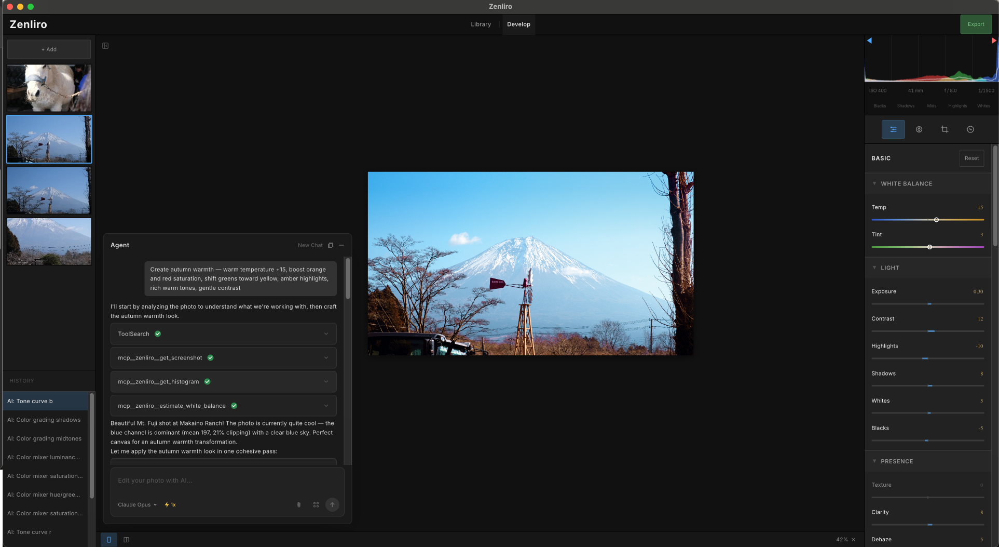

# Zenliro


[English](./README.md) | [Tiếng Việt](./README.vi.md) | [日本語](./README.ja.md) | [中文](./README.zh.md) | [한국어](./README.ko.md)

> **Enhance, not alter.** Приложение для обработки фотографий, вдохновлённое Lightroom Classic и работающее на базе AI Agent.

Zenliro — это настольный инструмент для обработки фотографий и цветокоррекции, созданный для фотографов, которым важны настроение, тон и аутентичность. Это не деструктивный редактор — никакого удаления объектов, никакого инпейнтинга. Только свет, цвет и ощущение.

---

## Демо

- Основное рабочее пространство: 
- Режим сравнения: 
- Пакетное редактирование AI: 

---

## Сайт

[zenliro](https://zenliro.vercel.app/)

---

## Возможности

- **Обработка фотографий** — Импорт форматов Raw, JPG, PNG, WebP, BMP, GIF и TIFF. Просмотр метаданных EXIF и общей гистограммы с одного взгляда.
- **Модуль Develop** — Полный паритет панелей с Lightroom Classic: Basic, Tone Curve, HSL, Color Grading, Detail и другие.
- **Горячие клавиши** — Интуитивные шорткаты, разработанные для эффективного рабочего процесса.
- **Библиотека фотографий** — Удобное управление фотографиями по папкам с поддержкой drag-and-drop.
- **AI Agent** — Агент анализирует вашу фотографию, планирует настройки и редактирует в реальном времени. Наблюдайте, как он работает, словно фотограф за пультом управления. Может копировать стиль эталонного изображения или самостоятельно создавать наилучший возможный результат.
- **Пакетное редактирование с AI** — Передайте пакет фотографий AI Agent для обработки. Агент автоматически отредактирует их и уведомит по завершении.
- **Неразрушающее редактирование** — Полная история отмены/повтора. Оригинальный файл никогда не изменяется.
- **Стилевые пресеты** — 20+ кураторских образов для разных настроений и жанров.
- **Рендеринг WebGL** — Собственные шейдеры для обработки цвета в реальном времени полностью на GPU.

---

## Технологический стек

```
Electron
├── React + Vite + TypeScript      → UI (архитектура Feature-Sliced Design)
├── Shadcn/ui + Tailwind CSS       → Система компонентов
├── WebGL (собственные шейдеры)     → Обработка цвета на GPU в реальном времени
├── Zustand                        → Управление состоянием
└── MCP сервер                     → AI-агент для интеллектуального редактирования фото
```

---

## Начало работы

```bash
pnpm install
pnpm dev
```

### Сборка

На данный момент поддерживается только macOS

```bash
pnpm dist:mac    # macOS DMG (arm64)
```

### Установка из GitHub Releases (.dmg)

#### Шаг 1: Скачайте `.dmg` со страницы [Releases](https://github.com/LeHoangTuanbk/zenliro/releases) и установите обычным способом.

#### Шаг 2: Поскольку это приложение с открытым исходным кодом без подписи и нотаризации, macOS может заблокировать его при первом запуске:


Чтобы исправить, откройте Terminal и выполните:

```bash
xattr -cr /Applications/Zenliro.app
```

#### Шаг 3: Запустите Zenliro снова.

### AI-редактирование фотографий

Для использования функции AI-редактирования фотографий вам необходимо скачать и установить Claude Code или Codex CLI, либо оба:

- **Claude Code**: https://code.claude.com/docs/en/overview
- **Codex CLI**: https://developers.openai.com/codex/cli

---

## TODO

- [ ] Исправление ошибок
- [ ] Добавить более качественные функции управления фотографиями и удобные горячие клавиши
- [ ] Оптимизировать производительность обработки изображений
- [ ] Улучшить редактирование фотографий агентом
- [ ] Поддержка мультиразрешающего пайплайна
- [x] Поддержка формата RAW

---

## Как внести вклад

1. Откройте issue для обсуждения того, что вы хотите сделать.
2. Когда подход и стратегия реализации согласованы, сделайте форк репозитория.
3. Отправьте PR с вашими изменениями.
4. При необходимости обновите документацию и добавьте тестовые сценарии.

---

## Вдохновлено

- [Lightroom Classic](https://www.adobe.com/products/photoshop-lightroom-classic.html)
- [RapidRAW](https://github.com/CyberTimon/RapidRAW)
- [Pencil](https://www.pencil.com)

---

## Лицензия

Распространяется под лицензией [AGPL-3.0](./LICENSE).

Если вы распространяете или развёртываете изменённую версию Zenliro — в том числе в виде размещённого сервиса — вы обязаны открыть исходный код под той же лицензией и указать оригинальный проект.
