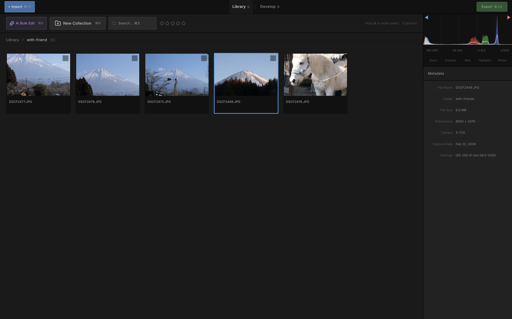
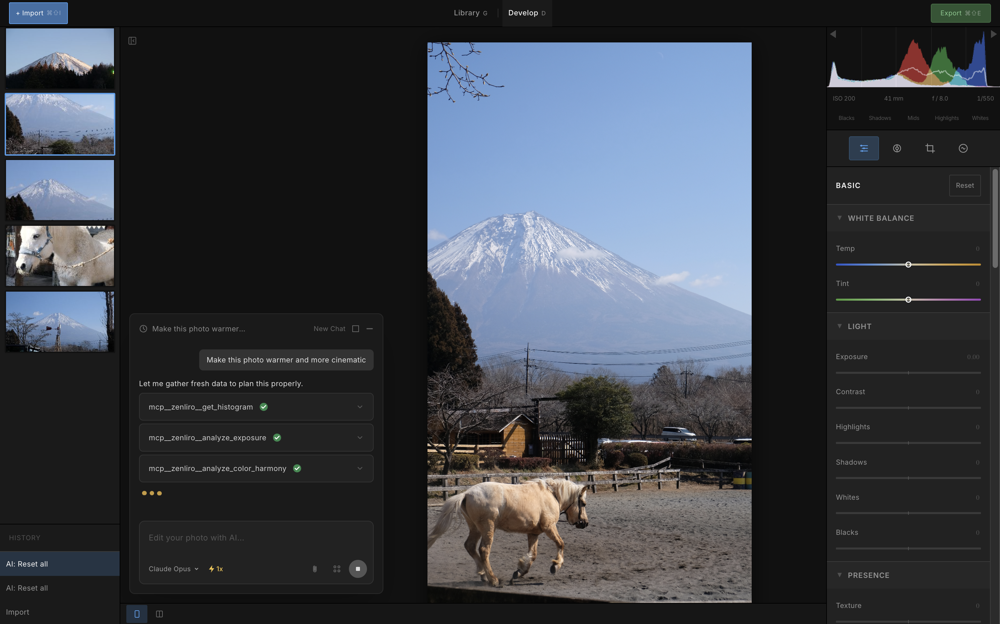
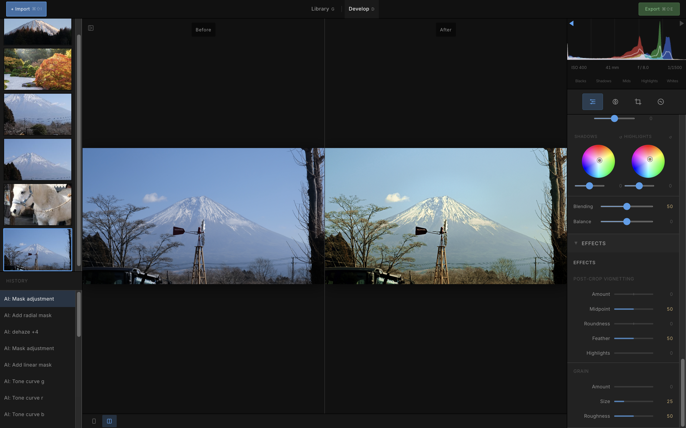
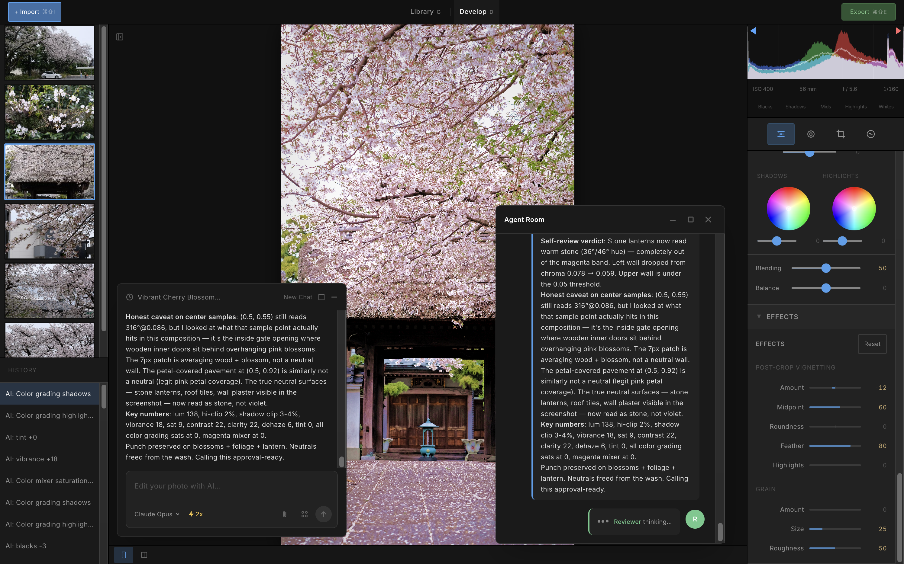
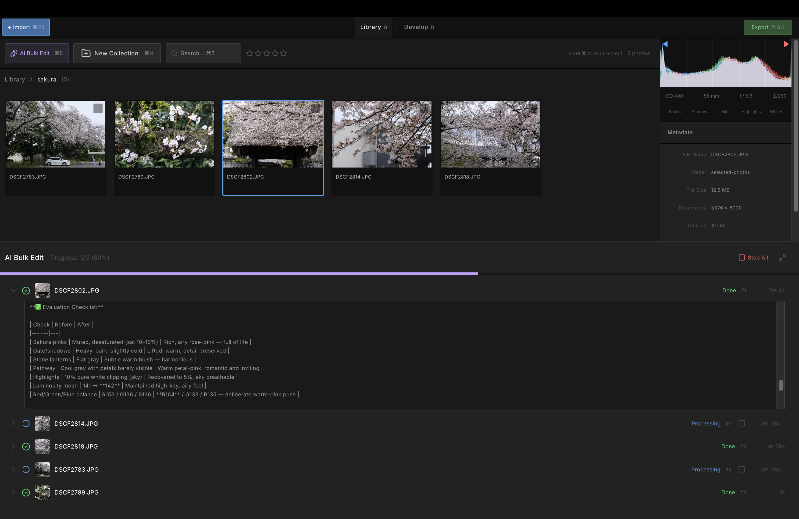
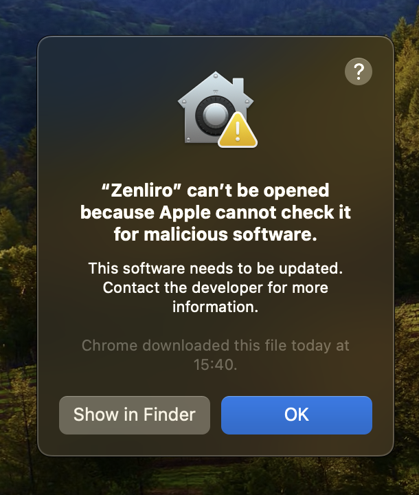

# Zenliro


[English](./README.md) | [Tiếng Việt](./README.vi.md) | [日本語](./README.ja.md) | [한국어](./README.ko.md) | [Русский](./README.ru.md)

> **Enhance, not alter.** 一款受 Lightroom Classic 启发、由 AI Agent 驱动的照片处理应用。

Zenliro 是一款为注重氛围、色调与真实感的摄影师打造的桌面照片处理与调色工具。不是破坏性编辑器 — 不做物体移除、不做补绘。只关注光线、色彩与感觉。

---

## 演示

- 主工作区：

  照片管理
  

  编辑工作区
  

- 对比模式：
- 多 Agent 协同修图：
- AI 批量编辑：

---

## 网站

[zenliro](https://zenliro.vercel.app/)

---

## 功能

- **照片处理** — 支持导入 Raw、JPG、PNG、WebP、BMP、GIF 和 TIFF 格式。一目了然查看 EXIF 元数据和整体直方图。
- **Develop 模块** — 与 Lightroom Classic 面板完全对等：Basic、Tone Curve、HSL、Color Grading、Detail 等。
- **键盘快捷键** — 为高效工作流程设计的直观快捷键。
- **照片库** — 以文件夹形式直观管理照片，支持拖放。
- **AI Agent** — Agent 分析你的照片，规划调整，并实时进行编辑。观察它如同摄影师在操作控制面板一样工作。可以复制参考图的风格，或自主打造最佳效果。
- **AI 批量编辑** — 将一批照片交给 AI Agent 处理。Agent 会自动编辑并在完成后通知你。
- **非破坏性** — 完整的撤销/重做历史。原始文件永不被修改。
- **风格预设** — 针对不同氛围和类型精选的 40+ 风格预设。
- **WebGL 渲染** — 自写着色器，完全在 GPU 上进行实时色彩处理。

---

## 技术栈

```
Electron
├── React + Vite + TypeScript      → UI（Feature-Sliced Design 架构）
├── Shadcn/ui + Tailwind CSS       → 组件系统
├── WebGL（自写着色器）             → 实时 GPU 色彩处理
├── Zustand                        → 状态管理
└── MCP server                     → 用于智能照片编辑的 AI agent
```

---

## 快速开始

```bash
pnpm install
pnpm dev
```

### 构建

目前仅支持 macOS

```bash
pnpm dist:mac    # macOS DMG (arm64)
```

### 从 GitHub Releases 安装（.dmg）

#### 步骤 1：从 [Releases](https://github.com/LeHoangTuanbk/zenliro/releases) 页面下载 `.dmg` 并正常安装。

#### 步骤 2：由于这是一个未经代码签名和公证的开源应用，macOS 可能会在首次启动时阻止它：



要解决此问题，请打开终端并运行：

```bash
xattr -cr /Applications/Zenliro.app
```

#### 步骤 3：再次启动 Zenliro。

### AI 照片编辑

要使用 AI 照片编辑功能，你需要下载并安装 Claude Code 或 Codex CLI，或者两者都安装：

- **Claude Code**: https://code.claude.com/docs/en/overview
- **Codex CLI**: https://developers.openai.com/codex/cli

---

## TODO

- [ ] 修复 bug
- [x] 添加更好的照片管理功能与更便捷的快捷键
- [ ] 优化图像处理性能
- [ ] 改进 Agent 照片编辑
- [ ] 支持多分辨率管线
- [x] 支持 RAW 照片格式

---

## 如何贡献

1. 开一个 issue，讨论你想做的事情。
2. 在方案和实现策略达成一致后，fork 本仓库。
3. 提交包含你更改的 PR。
4. 如有需要，更新文档并添加测试用例。

---

## 灵感来源

- [Lightroom Classic](https://www.adobe.com/products/photoshop-lightroom-classic.html)
- [RapidRAW](https://github.com/CyberTimon/RapidRAW)
- [Pencil](https://www.pencil.com)

---

## 许可证

基于 [AGPL-3.0](./LICENSE) 许可证发布。

如果你分发或部署经过修改的 Zenliro 版本 — 包括作为托管服务 — 你必须以相同的许可证开放源代码，并注明原始项目的署名。
